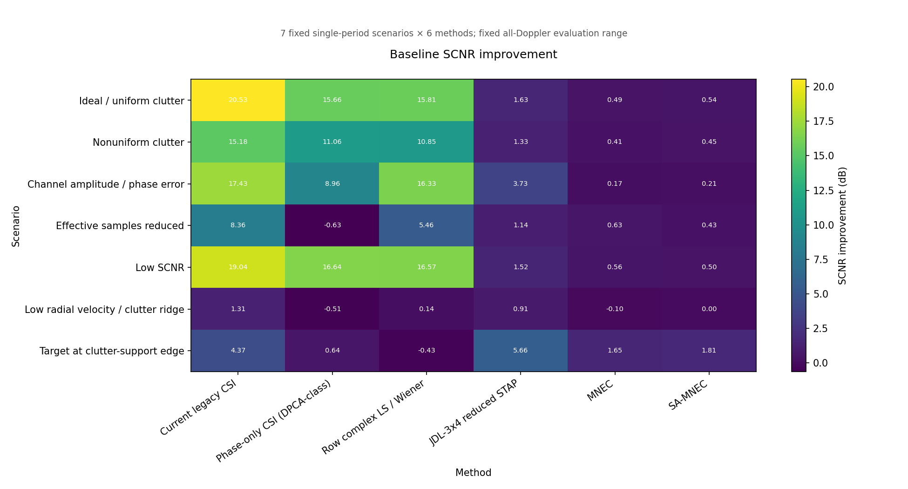
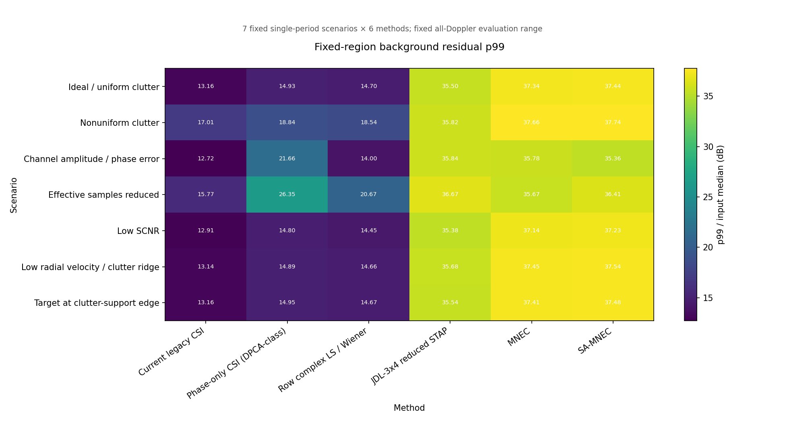
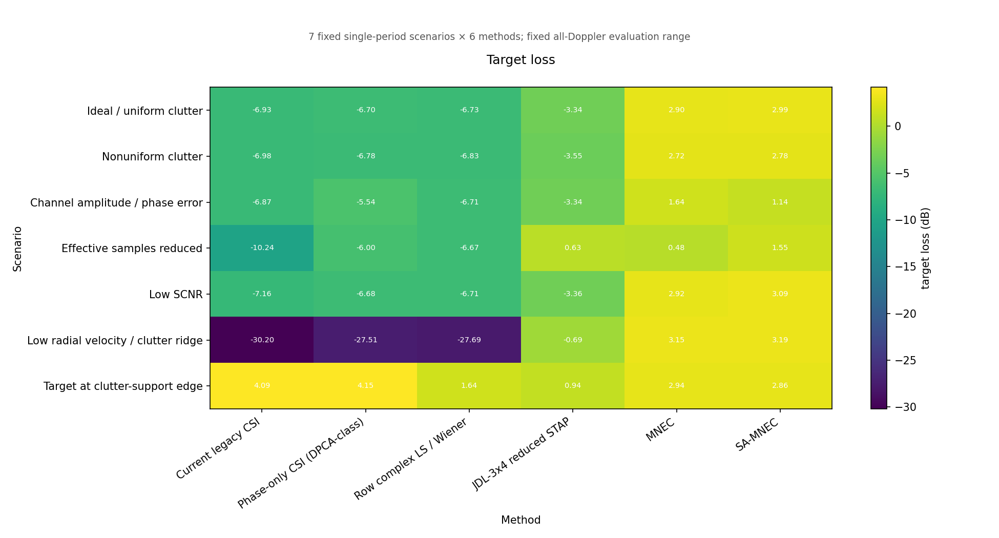
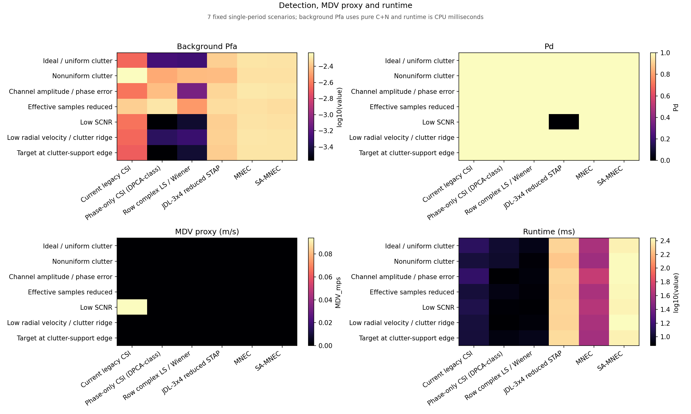

# 第一阶段 GMTI 杂波对消 Baseline 实验报告

## 1. 技术摘要：当前 CSI 在严格同输入组内仍是最稳妥基线

本轮暂停 AI 训练，使用 Stage2 单周期、单波位、130 PRT 仿真，比较 7 个场景和
6 个传统方法，共 42 条 `case × method` 结果。严格 F1/F2 组内，Current
`legacy_min_magnitude` 的 7 场景平均 SCNR 提升为 **12.318 dB**，高于
Phase-only CSI 的 7.403 dB 和背景训练 Row-LS/Wiener 的 9.246 dB；但它在
非均匀杂波、有效样本不足、近杂波脊和支撑边缘分别暴露出不同退化。

4 通道 academic reference 没有被混入严格排名：本轮简化的 JDL/MNEC/SA-MNEC
平均 SCNR 提升分别为 2.276/0.546/0.563 dB，固定区残余 p99 约 35.8/36.9/37.0 dB，
说明“直接切换到更高维输入”在当前简化 steering、协方差和训练区设置下不能
自动解决问题。这是当前实现的诊断结果，不是对文献算法普遍性能的判断。

本轮没有训练 AI，也没有端到端 `clutter-free RD` 网络。结论支持的下一步仍是
“物理模型保留 + 参数残差学习 + 置信度门控”。

## 2. 实验问题、范围和比较口径

本报告回答：

1. 在相同 F1/F2 接口和后端 CFAR 下，Current、相位-only 和背景复权的差别是什么？
2. 非均匀杂波、通道幅相误差、有效样本不足、低 SCNR、近杂波脊和支撑边缘会把
   哪些指标推坏？
3. 原始四通道 reduced STAP/MNEC/SA-MNEC 是否能作为额外传统参考？

F1/F2 strict 与 4-channel academic reference 是两个比较组，**不把两组的
SCNR、CA 或 Pfa 直接当作同一排行榜**。每个场景只使用一个固定 seed、一个周期；
所有平均值都是 7 个场景的等权描述性平均，不是跨 seed 的统计估计。

## 3. 场景实际状态

下表来自 [`baseline_scenario_summary.csv`](../outputs/ai_csi_baseline/baseline_scenario_summary.csv)，
不是仅由配置名推断。目标频率和支撑边缘距离由生成后的 truth 读取。

| 场景 | 目标相对杂波中心 | 动态支撑 | 支撑边缘有符号距离 | 有效样本 |
|---|---:|---:|---:|---:|
| Ideal / uniform clutter | -53.434 Hz | 42–88 行 | 18 行 | 130/130 |
| Nonuniform clutter | -54.990 Hz | 42–88 行 | 18 行 | 130/130 |
| Channel amplitude / phase error | -52.440 Hz | 42–88 行 | 18 行 | 130/130 |
| Effective samples reduced | -53.623 Hz | 42–88 行 | 18 行 | 45/130（丢失 85） |
| Low SCNR | -52.667 Hz | 42–88 行 | 18 行 | 130/130 |
| Low radial velocity / clutter ridge | +1.050 Hz | 42–88 行 | 23 行 | 130/130 |
| Target at clutter-support edge | -213.531 Hz | 42–88 行 | 2 行 | 130/130 |

通道幅相场景的配置为 +2.5 dB 相对幅度、18° 固定相位和 3° 抖动；样本不足场景
使用通道丢失概率 0.55，实际丢失数由 seed 决定。非理想 target/background 的
impairment truth 已逐行核对：除 `case_id` 外 130 行逐字段一致。

## 4. 主要指标的描述性汇总

下表是每个方法在 7 个场景上的等权均值。`p99/input median` 是固定全 Doppler、
固定距离区间的残余 p99 相对 C+N 输入中位数；`high` 是超过 +15 dB 阈值的单元数；
FA/Pfa 只来自纯 C+N background；runtime 包含背景权重训练但不含仿真和 MDV sweep。

| 方法 | 比较组 | CA/CSR (dB) | SCNR 提升 (dB) | target_loss_dB | p99/input median (dB) | high 点 | FA | Pfa | Pd | runtime (ms) |
|---|---|---:|---:|---:|---:|---:|---:|---:|---:|---:|
| Current legacy CSI | F1/F2 strict | 19.455 | 12.318 | -9.184 | 13.980 | 3,760 | 1,616 | 0.003065 | 1.000 | 12.0 |
| Phase-only CSI | F1/F2 strict | 15.950 | 7.403 | -7.867 | 18.060 | 14,994 | 1,043 | 0.001979 | 1.000 | 8.5 |
| Row complex LS / Wiener | F1/F2 strict | 17.549 | 9.246 | -8.529 | 15.955 | 9,390 | 701 | 0.001330 | 1.000 | 8.1 |
| JDL-3x4 reduced STAP | 4-channel academic reference | -0.691 | 2.276 | -1.815 | 35.775 | 75,602 | 2,288 | 0.004339 | 0.857 | 199.0 |
| MNEC | 4-channel academic reference | -1.871 | 0.546 | +2.394 | 36.921 | 82,815 | 2,615 | 0.004959 | 1.000 | 41.8 |
| SA-MNEC | 4-channel academic reference | -1.975 | 0.563 | +2.514 | 37.029 | 85,592 | 2,595 | 0.004921 | 1.000 | 260.3 |

这些均值只用于压缩展示；完整 42 行、`input/output_SCNR_dB`、p95、目标功率、
CFAR 候选单元和 MDV proxy 在 [`baseline_summary.csv`](../outputs/ai_csi_baseline/baseline_summary.csv)。

## 5. 图表证据

### 5.1 SCNR 提升矩阵显示严格组内的退化位置

图中每格是一个场景 × 方法，不是跨场景时间趋势。严格组内，Current 在理想、低
SCNR、幅相误差场景分别达到 20.53、19.04、17.43 dB；样本不足降到 8.36 dB，
近杂波脊降到 1.31 dB，支撑边缘降到 4.37 dB。边缘场景的 JDL 5.66 dB 不可与
Current 直接合并解释，因为它使用的是 12 维四通道 space-time 输入。

### 5.2 固定评价区 p99 和目标损失揭示“压尾部”与“保目标”的冲突

Row-LS 在理想场景把 FA 从 Current 的 1,165 降到 272、Pfa 从 0.002209 降到
0.000516；在幅相误差场景把 FA 从 1,270 降到 419。然而它的平均 SCNR 提升仍
低于 Current，且 target_loss_dB 为负。这说明用 C+N LS 权重降低残余尾部不等价于
提高目标区域的整体 SCNR，后续优化必须同时约束目标保持、噪声放大和高能尾部。

### 5.3 FA、Pd、MDV proxy 和 runtime

纯背景 Pfa 在本轮约为 `2.69e-4` 到 `5.86e-3`；这不是配置中 `1e-6` 的理论
Pfa，而是非白杂波/残余结构经过固定 CPU GO-CFAR 几何后的实际背景命中率。
Pd 是一个目标 ROI 至少命中一次的布尔检测代理，本轮除 JDL 的低 SCNR case 为 0
外均为 1，因此不能据此宣称检测概率已统计收敛。

MDV 仅做近杂波中心的固定行偏移 sweep。大多数方法返回 0 m/s，反映 sweep 中
包含当前目标/中心邻近行和单目标 CFAR 代理，不足以作为正式 MDV 结论；它保留在
CSV 中供后续改成完整速度曲线时回归。

## 6. 分场景结果和失败模式

下表每格依次为 `SCNR提升 / target_loss_dB / p99相对输入中位数 / high点 / FA`。
完整字段仍以 CSV 为准。

### 6.1 F1/F2 strict

| 场景 | Current | Phase-only | Row-LS/Wiener |
|---|---|---|---|
| Ideal / uniform | 20.53 / -6.93 / 13.16 / 1,995 / 1,165 | 15.66 / -6.70 / 14.93 / 5,129 / 285 | 15.81 / -6.73 / 14.70 / 4,510 / 272 |
| Nonuniform | 15.18 / -6.98 / 17.01 / 10,427 / 3,092 | 11.06 / -6.78 / 18.84 / 18,232 / 1,787 | 10.85 / -6.83 / 18.54 / 16,568 / 1,981 |
| Amp/phase error | 17.43 / -6.87 / 12.72 / 1,600 / 1,270 | 8.96 / -5.54 / 21.66 / 20,164 / 2,043 | 16.33 / -6.71 / 14.00 / 3,206 / 419 |
| Effective samples reduced | 8.36 / -10.24 / 15.77 / 6,973 / 2,278 | -0.63 / -6.00 / 26.35 / 46,385 / 2,665 | 5.46 / -6.67 / 20.67 / 28,451 / 1,596 |
| Low SCNR | 19.04 / -7.16 / 12.91 / 1,735 / 1,257 | 16.64 / -6.68 / 14.80 / 4,880 / 144 | 16.57 / -6.71 / 14.45 / 4,140 / 187 |
| Low radial / ridge | 1.31 / -30.20 / 13.14 / 1,711 / 1,166 | -0.51 / -27.51 / 14.89 / 5,003 / 238 | 0.14 / -27.69 / 14.66 / 4,383 / 262 |
| Support edge | 4.37 / +4.09 / 13.16 / 1,882 / 1,083 | 0.64 / +4.15 / 14.95 / 5,163 / 142 | -0.43 / +1.64 / 14.67 / 4,471 / 191 |

最清晰的 strict 结论有三条：

1. 非均匀杂波把 Current 的 SCNR 提升从理想 20.53 降到 15.18 dB，同时 high
   点从 1,995 增至 10,427、Pfa 从 0.002209 增至 0.005864。
2. 有效样本从 130 降到 45 后，Current 仍比两个 strict 参考稳定，但 SCNR 提升
   下降到 8.36 dB；Phase-only 变为 -0.63 dB，表明单相位方案对样本/幅度失配
   很敏感。
3. 近杂波脊的 Current 目标损失为 -30.20 dB，支撑边缘目标的 Current
   target_loss_dB 反而为 +4.09 dB；两者都提醒不能只用 Pd 或 SCNR 提升单指标
   判断目标是否被保留。

### 6.2 4-channel academic reference

下表每格依次为 `SCNR提升 / target_loss_dB / p99相对输入中位数 / FA / Pd`。

| 场景 | JDL-3x4 reduced STAP | MNEC | SA-MNEC |
|---|---|---|---|
| Ideal / uniform | 1.63 / -3.34 / 35.50 / 2,267 / 1 | 0.49 / +2.90 / 37.34 / 2,615 / 1 | 0.54 / +2.99 / 37.44 / 2,595 / 1 |
| Nonuniform | 1.33 / -3.55 / 35.82 / 2,020 / 1 | 0.41 / +2.72 / 37.66 / 2,565 / 1 | 0.45 / +2.78 / 37.74 / 2,552 / 1 |
| Amp/phase error | 3.73 / -3.34 / 35.84 / 2,399 / 1 | 0.17 / +1.64 / 35.78 / 2,683 / 1 | 0.21 / +1.14 / 35.36 / 2,675 / 1 |
| Effective samples reduced | 1.14 / +0.63 / 36.67 / 2,504 / 1 | 0.63 / +0.48 / 35.67 / 2,551 / 1 | 0.43 / +1.55 / 36.41 / 2,496 / 1 |
| Low SCNR | 1.52 / -3.36 / 35.38 / 2,279 / 0 | 0.56 / +2.92 / 37.14 / 2,590 / 1 | 0.50 / +3.09 / 37.23 / 2,581 / 1 |
| Low radial / ridge | 0.91 / -0.69 / 35.68 / 2,293 / 1 | -0.10 / +3.15 / 37.45 / 2,663 / 1 | 0.00 / +3.19 / 37.54 / 2,637 / 1 |
| Support edge | 5.66 / +0.94 / 35.54 / 2,253 / 1 | 1.65 / +2.94 / 37.41 / 2,635 / 1 | 1.81 / +2.86 / 37.48 / 2,629 / 1 |

JDL 在支撑边缘 case 的 SCNR 提升为 5.66 dB，但固定区 p99 仍为 35.54 dB；
MNEC/SA-MNEC 的目标损失均值为正，说明本轮简化 spatial steering/子空间策略
存在明显的目标/杂波子空间冲突。结果足以说明需要先做传统实现的校准、训练区和
秩选择诊断，不足以支持“论文方法无效”的结论。

## 7. 计算和证据核查

本轮实际核查：

- CSV 有 7 个场景、6 个方法、42 行；每个关键数值列均为有限值。
- `false_alarm_count` 与 `background_Pfa` 对纯 C+N background 计算，CFAR
  测试单元分母为 527,280。
- 7 个场景都记录 target/background BIN 的路径、大小和 SHA-256；原始 BIN 在
  处理完成后已删除，摘要仍保留输入身份。
- manifest 记录源码 commit `7099e2e5ff1b88b4d2a2a22638649e1e808f7f63`、
  dirty worktree、Release 仿真器 SHA-256、Python/NumPy/Matplotlib 和
  `nvidia-smi` 探测结果。
- 本机 `nvidia-smi` 返回无法与 NVIDIA driver 通信；因此 runtime 是 CPU 离线
  方法时间，不能写成 CUDA 性能。

这些检查证明产物和指标链路完整，不证明一个 seed 可以代表统计泛化，也不证明
academic reference 已达到论文级最优实现。

## 8. 结论与下一步

第一阶段当前最可靠的结论是：

1. Current 仍是 F1/F2 strict 的主基线；其主要风险不是单独 P38 phase，而是
   非均匀杂波、有效样本不足、近杂波脊和支撑边缘的联合失配。
2. 背景 LS/Wiener 能降低部分 FA/high 尾部，但会牺牲整体 SCNR，不能直接当作
   唯一 Oracle 标签。
3. 简化四通道 JDL/MNEC/SA-MNEC 需要先解决物理 steering、训练样本、秩/加载和
   目标保持，否则仅增加输入维度会放大残余和运行时。
4. 下一步应先补传统基线的多 seed 统计和 academic 参数审计，再在物理链路外接
   小型 residual head；不进入端到端 clutter-free RD 网络。

## 9. 延后问题

- 以 seed/scenario 分层后，Current 与背景 LS 在 `target_loss_dB`、Pfa 和 high
  点之间的 Pareto 前沿是什么？
- 在不使用目标 truth 的前提下，能否通过 C+N 的 steering/协方差一致性估计修正
  academic reference 的子空间选择？
- 当有效样本率低于 45/130 时，应该学习 `g_m` 门控、协方差收缩还是旁路当前 CSI？
- `MDV_mps` 需要扩展为固定目标幅度、固定杂波背景下的全速度 sweep，才能用于
  正式检测阈值比较。
